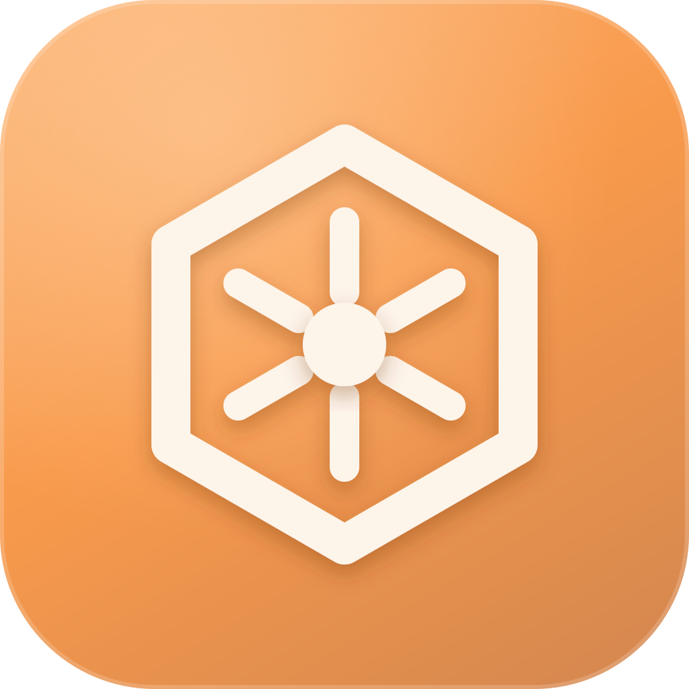
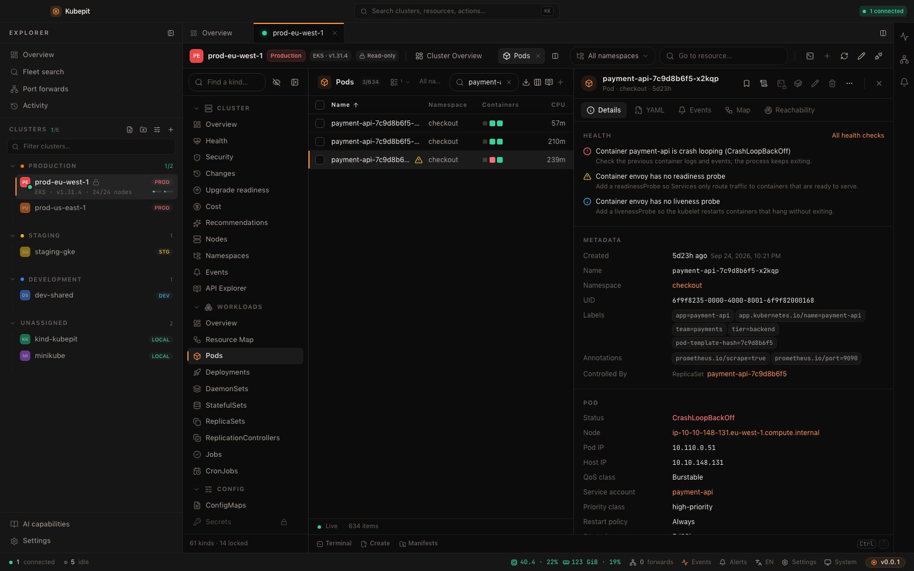

<p align="center">
  
</p>

<h1 align="center">Kubepit</h1>

<p align="center">
  <strong>Kümeleriniz. Kokpitiniz.</strong><br />
  Kubernetes filonuzu anlamak, sorunları çözmek ve değişiklikleri yönetmek için yerel öncelikli bir IDE.
</p>

<p align="center">
  <a href="https://erdembas.github.io/kubepit/">Web sitesi</a> ·
  <a href="https://erdembas.github.io/kubepit/demo/">Tarayıcı demosunu dene</a> ·
  <a href="../README.md">English</a> ·
  <a href="../CONTRIBUTING.md">Katkıda bulun</a>
</p>

<p align="center"><strong>v0.0.4 · Deneysel · MIT lisanslı · Türkçe ve İngilizce</strong></p>

Kubepit; canlı kaynak tablolarını, logları, terminalleri, topolojiyi, değişiklik
geçmişini, Helm'i, GitOps'u ve filo işlemlerini tek masaüstü çalışma alanında
buluşturur. Bir sorunu, hata veren iş yükünden loglarına, bağımlılıklarına ve son
değişikliklerine kadar izleyin; çözümü aynı yerde gözden geçirin.

**Ürünün tamamı açık kaynak.** Ücretli sürüm, hesap zorunluluğu veya özellik
paketleri yok. MIT lisansı kişisel ve ticari kullanıma izin verir. Tercih ettiğiniz
barındırılan yapay zekâ sağlayıcıları gibi isteğe bağlı hizmetlerin kendi koşulları
ve ücretleri olabilir.

Kubepit, gelişiminin başındaki bir topluluk projesidir. Eksikler ve değişebilen API'ler bekleyin.
Önce demoyla veya geliştirme kümesiyle başlayın.
[İndirme sayfasından](https://erdembas.github.io/kubepit/tr/#downloads) kurulum
paketini seçin veya kaynak koddan derleyin. Sayfa yalnızca yayımlanmış paketleri
gösterir ve imza durumlarını belirtir. **0.0.3**, Linux özel eylemlerinde zaman aşımı veya arka plan pipe
temizliği sırasında hedef alt süreç grubunun dışındaki süreçleri durdurabilen bir
hatayı düzelten sürümdür. **0.0.1 ve 0.0.2 bu hatadan etkilenir**; bu sürümleri kurmayın veya
kullanmaya devam etmeyin. **0.0.3 veya daha yeni** bir paket yayımlandığında elle
kurmanızı öneririz. 0.0.1 güncelleyici anahtarı içermez; anahtarın eklendiği
0.0.2 bu düzeltmeden öncedir. Düzeltilmiş uygulama açılışta ve her
beş dakikada imzalı güncelleme kontrolü, sürüm notları ve kullanıcının başlattığı
kurulum/yeniden başlatma seçenekleri sunar.

**0.0.4 yenilikleri:** yönlendirmeli Pod tanılaması, yapılandırma etki incelemesi, filo imaj sürüm matrisi ve incelenerek başlatılan node bakımı; ayrıca kayıtlı incelemeler, tanılama araçları ve akıllı kayıtlı aramalar. Tam [sürüm notlarını](../CHANGELOG.md) uygulamada veya [web sitesinde](https://erdembas.github.io/kubepit/tr/changelog/) okuyun.



## Masaüstü uygulamasını kurun

[İndirme sayfası](https://erdembas.github.io/kubepit/tr/#downloads), yayımlanmış
paketleri işletim sistemi, işlemci ve biçime göre sunar. Deneysel yayınlar ön sürüm
kanalındadır. Her kaynak etiketi sabit kalır; derleme bilgileri ve SHA-256
sağlama toplamları [GitHub sürümüne](https://github.com/erdembas/kubepit/releases) eklenir.

| Sistem    | İşlemci               | Paket biçimleri          |
| --------- | --------------------- | ------------------------ |
| macOS 11+ | Apple Silicon / Intel | DMG                      |
| Linux     | ARM64 / x64           | AppImage, DEB, RPM       |
| Windows   | x64                   | NSIS kurulum paketi, MSI |
| Windows   | ARM64                 | NSIS kurulum paketi      |

macOS'ta [Kubepit Homebrew cask dosyası](https://github.com/erdembas/homebrew-tap),
her iki işlemci için doğrulanan sürümleri altı saatte bir kontrol eder:

```bash
brew install --cask erdembas/tap/kubepit
# Daha sonra yeni sürüm yayımlandığında:
brew update
brew upgrade --cask kubepit
```

İşlemcinize uygun paketi seçin; tarayıcı mimariyi güvenilir biçimde belirleyemez.
Linux paketleri WebKitGTK 4.1 dâhil platform kütüphanelerini gerektirir; AppImage
her dağıtımla uyumluluk sağlamaz. Windows, WebView2 kullanır. İlgili özelliklerin
istediği `kubectl`, Helm ve sağlayıcı kimlik doğrulama yardımcıları harici araçlardır.

Yeni macOS yayınlarında Developer ID imzası ve Apple noter onayı zorunludur;
eski v0.0.1 paketleri ad-hoc imzalı kalır. Windows yayıncı imzası güncelleyici
imzasından ayrıdır ve isteğe bağlıdır. Homebrew işletim sistemi kontrollerini
atlatmaz. İmza, sağlama toplamı ve doğrulama sınırları için
[sürüm notlarını](https://github.com/erdembas/kubepit/releases) ve
[yayımlama rehberini](RELEASING.md#türkçe) okuyun. Linux güncellemeleri AppImage, DEB veya RPM biçimini korur; paket yöneticisiyle
kurulum yönetici izni isteyebilir. Otomatik
kontrol, Ayarlar → Hakkında ve Güncellemeler bölümünden kapatılabilir.

## Bir kümeye bağlanmadan deneyin

[Tarayıcı demosu](https://erdembas.github.io/kubepit/demo/), gerçek masaüstü
arayüzünü bellekte çalışan bir arka uçla sunar. Kümeler, iş yükleri, loglar,
metrikler ve olaylar örnek veridir. Hesap, kubeconfig veya Kubernetes kümesi
gerekmez. Küme işlemleri ve yapay zekâ yanıtları simüle edilir; gerçek kabuk, küme
veya yapay zekâ sağlayıcısı çalıştırılmaz. Kaynak değişiklikleri sayfa yenilenince
sıfırlanır; bazı arayüz tercihleri tarayıcı deposunda kalabilir. Demoya gerçek
kimlik bilgilerinizi girmeyin.

Kısa bir tur:

1. `prod-eu-west-1` kümesini açın; filo ve küme özetlerini inceleyin.
2. `checkout/payment-api-7c9d8b6f5-x2kqp` kaynağını bulun; loglarını, olaylarını ve kaynak haritasını açın.
3. Sağlık, Değişiklikler, Ağ Politikası ve Öneriler görünümleriyle örnek filoyu farklı açılardan inceleyin.
4. Helm ve GitOps'u keşfedin; örnek bir kaynağı değiştirmeden önce farkı inceleyin.
5. Ayarlar'dan klavye modunu açın veya simüle edilen Asistan'ı ve bir demo kümesini etkinleştirip bağlam önizlemesini deneyin.

Yerel önizleme için yalnızca Node.js 22+ ve pnpm 9.14.4 gerekir:

```bash
git clone https://github.com/erdembas/kubepit.git
cd kubepit
pnpm install --frozen-lockfile
pnpm dev:ui
```

## İncelemeden değişikliğe kadar iş akışınızın yanında

### Filonuz için bir çalışma alanı

Kubeconfig dosyalarını içe aktarın veya yapıştırın; kümeleri renkli bölümlerde
düzenleyin, etiketler ve ortam bilgileri ekleyin, bağlı kümelerde ortak arama yapın.
Kümeler arasındaki kaynakları karşılaştırın, farklılaşmayı inceleyin ve bir manifesti
uygulamadan önce birden fazla hedefte gözden geçirin. Bölünmüş paneller, sabitlenmiş
sekmeler, kaydedilmiş tablo görünümleri, yer imleri ve birden fazla pencere gerekli
bağlamı elinizin altında tutar.

### Kanıtları takip edin

Bir iş yükünden olay incelemesi başlatıp mevcut logları, event'leri, kaynak
durumunu, son değişiklikleri ve metrikleri notlarınızla birlikte kaydedin.
Kanıtları filo veya küme ekranından çevrimdışı açın; dışa aktarmadan önce
maskelenmiş paketi gözden geçirin. Bağlantı Doktoru küme erişimini aşamalı
olarak denetler. Ağ Tanılama, seçilen çalışan container'dan bir Service'e
kullanıcı tarafından başlatılan, süre sınırlı DNS, TCP ve HTTP/TLS testleri
çalıştırır ve endpoint bilgisini gösterir. Testler Pod exec izni ve salt okunur
olmayan bir küme gerektirir; container'da eksik araçlar ayrıca belirtilir.

Canlı tablolar yerleşik kaynakları ve keşfedilen CRD'leri kapsar. Kaynak haritasında
ilişkili nesneleri açın; bir iş yükünün pod ve container loglarını birleştirin;
yapılandırılmış kayıtları seviyeye ve alana göre süzün; olayları, dağıtım
revizyonlarını ve değişiklikleri ilişkilendirin. CPU ve bellek geçmişi metrics-server
üzerinden, daha kapsamlı grafikler ve geçmiş loglar Prometheus ve Loki üzerinden
görüntülenebilir.

### Yapacağınız değişikliği önce görün

YAML tamamlama ve doğrulama, CRD'ler dâhil bağlı kümenin OpenAPI şemasını kullanır.
Sunucu taraflı dry-run, canlı kaynak ile olası sonuç arasındaki farkı gösterir;
üretim ortamında uygulama öncesi inceleme zorunludur. Helm yükseltmelerinde render
edilmiş ve canlı kaynak farkları, values şemaları ve yeni chart'ın kaldıracağı
alanlar görünür. Salt okunur kümeler, RBAC ipuçları ve üretim işlemlerinde ad yazarak
onaylama, hedefi ve sonucu görünür tutar.

### Klavye alışkanlıklarınızı koruyun

İsteğe bağlı vim/k9s tarzı gezinme; `j`/`k`, `/`, `:` komutları ve kaynak
kısayolları sunar. Özel eylemler kendi terminal veya arka plan komutlarınızı
çalıştırır ya da kaynak bağlamıyla URL açar. Desteklenen k9s eklenti tanımlarını,
dönüşüm notlarıyla birlikte içe aktarabilirsiniz. Kümeye ayarlı yerel terminal,
pod exec/attach, debug container'ları, dosya tarayıcısı ve kayıtlı port
yönlendirmeleri masaüstü iş akışına dâhildir.

Freelens tarzı kaynak incelemeyi seviyorsanız Kubepit, filo değişikliklerini
araştırmayı ve eylemleri gözden geçirmeyi aynı çalışma alanına taşır. Klavyeyle
çalışmayı tercih ediyorsanız bu alışkanlığı görsel ilişkiler, farklar ve geçmişle
birleştirir. Bu bir iş akışı tercihidir; genç bir projenin yerleşik araçlardan daha
hızlı veya güvenilir olduğunun kanıtı değildir. Kubepit, Freelens ve k9s'ten
bağımsız bir projedir.

## Özellikler ve gereksinimleri

| Alan                 | Sunulanlar                                                                                                            | Gereksinim veya sınır                                                                                                                      |
| -------------------- | --------------------------------------------------------------------------------------------------------------------- | ------------------------------------------------------------------------------------------------------------------------------------------ |
| Küme çalışma alanı   | Canlı kaynaklar, CRD'ler, ayrıntılar, YAML, olaylar, dışa aktarma, kayıtlı görünümler                                 | Kubeconfig ve Kubernetes RBAC; bulut exec-auth yardımcıları haricîdir                                                                      |
| Filo işlemleri       | Arama, karşılaştırma, farklılaşma, çok kümeli manifest inceleme, Kustomize kaynakları                                 | Bağlı hedefler; yerel Kustomize render işlemi `kubectl` kullanır                                                                           |
| Hata ayıklama        | Pod/iş yükü logları, yapılandırılmış süzme, exec/attach, node kabuğu, dosya tarayıcısı                                | Etkileşimli kabuk/debug için `kubectl`; node kabuğu ayrıcalıklı yardımcı pod oluşturur; dosya işlemleri container araçlarına ihtiyaç duyar |
| Dağıtım              | Rollout, revizyon farkları, geri alma, Helm release'leri, chart'lar, yükseltme incelemesi                             | Helm release inceleme yereldir; chart ve değişiklik işlemleri `helm` gerektirir                                                            |
| GitOps               | Argo CD ve Flux özeti, ayrıntılar ve desteklenen işlemler                                                             | İlgili CRD/controller kurulu olmalı; Argo/Flux CLI gerekmez                                                                                |
| Gözlemlenebilirlik   | Bellekte bir saate kadar CPU/bellek geçmişi, PromQL, Loki/LogQL, uyarılar                                             | Temel kullanım için metrics-server; kapsamlı veriler için uygun küme içi Prometheus/Loki ve izinler                                        |
| Sağlık ve güvenlik   | Sağlık kuralları, sertifika süreleri, Pod Security kontrolleri, Trivy raporları, RBAC inceleme                        | Trivy görünümü kurulu Trivy Operator raporlarını okur; image taraması yapmaz                                                               |
| Ağ görünürlüğü       | İlişki haritası, NetworkPolicy açıklamaları, erişilebilirlik matrisi                                                  | Standart NetworkPolicy simülasyonudur; canlı trafik testi değildir; CNI'ye özel politikalar ve eksik veri belirtilir                       |
| Değişiklik geçmişi   | Bellekte değişiklik zaman çizelgesi, yerel işlem kaydı, isteğe bağlı kalıcı olay/değişiklikler, incelenerek geri alma | Gözlenen etkinlikleri kaydeder; API sunucusunun eksiksiz denetim kaydı veya haricî uyum arşivi değildir                                    |
| Maliyet ve kapasite  | OpenCost/Kubecost verisi veya etiketli tahminler, kaynak boyutlandırma kanıtları, kayıtlı öneri taramaları            | Kullanılabilirlik ve güven düzeyi kullanım geçmişine bağlıdır; tahminler bulut faturası veya garanti edilmiş tasarruf değildir             |
| Yükseltmeye hazırlık | Nesneler, Helm, CRD'ler ve isteğe bağlı istek metriklerinde eskiyen API bulguları                                     | Sürümlenmiş ve kapsamı sınırlı kurallar; denetlenmiş kapsamın dışındaki hedef sürümler belirtilir                                          |
| Asistan              | İş yükü tanısı, YAML, kubectl/PromQL/LogQL önerileri, bağlam önizlemesi                                               | Başlangıçta kapalıdır; kendi sağlayıcınız veya desteklenen kurulu ajan; veri kontrolleri aşağıda                                           |

Entegrasyonlar uygun yerlerde keşfedilir veya yapılandırılır. Kubepit, çalışma
alanını açmak için kümeye gözlemlenebilirlik, güvenlik veya GitOps controller'ları
kurmaz. Eksik izinler ve veriler, kümenin sağlıklı olduğunun kanıtı sayılmadan
belirtilir.

## Yerel öncelikli, veri sınırları açık

Kubepit hesabı, ürün telemetrisi veya barındırılan çalışma alanı eşitlemesi yoktur.
Masaüstü uygulaması kullandığınız kümeler ve entegrasyonlarla iletişim kurar. Helm
kataloğu, kimlik doğrulama yardımcıları, seçilen yapay zekâ sağlayıcıları ve
yapılandırılmış güncelleme akışı da kendi hizmetlerine bağlanabilir. Yerel
öncelikli olmak, bağlı işlemlerin çevrimdışı olduğu anlamına gelmez.

| Veri                                                                                                      | Saklandığı yer                                                                                     |
| --------------------------------------------------------------------------------------------------------- | -------------------------------------------------------------------------------------------------- |
| Küme kayıtları, ayarlar, çalışma alanı, kayıtlı yönlendirmeler, özel eylemler                             | `~/.kubepit/` altında JSON; `KUBEPIT_HOME` ile değiştirilebilir                                    |
| İçe aktarılan kubeconfig'ler                                                                              | Yalnızca sahibinin erişebildiği yönetilen dosyalar veya isteğe bağlı işletim sistemi kimlik deposu |
| İşlem kaydı, seçilen olay/değişiklik geçmişi, öneri taramaları ve isteğe bağlı yapay zekâ istek kayıtları | Saklama süresi ve boyut denetimleri olan yerel SQLite veritabanı: `~/.kubepit/history.db`          |
| Tablo tercihleri, kayıtlı görünümler, yer imleri                                                          | Masaüstü webview'ının yerel deposu                                                                 |
| Asistan konuşmaları                                                                                       | Bellek; isteğe bağlı maskelenmiş istek kaydı ayrı bir özelliktir                                   |

Kubepit orijinal kubeconfig dosyanızı yeniden yazmaz. Dosya içe aktarımı, işaret
edilen sertifika/token dosyalarını yönetilen bir anlık kopyaya gömer; exec kimlik
doğrulaması haricî programa ve onun kimlik bilgilerine ihtiyaç duymaya devam eder.
Anahtarlık modunda `kubectl`, Helm ve terminaller için geçici, tek bağlamlı
kubeconfig dosyaları oluşturulabilir; normal bağlantı kesme/kapanış temizliğinde
kaldırılır.

Masaüstü uygulamasında işlem kaydı varsayılan olarak açıktır. Küme olay ve
değişikliklerini kalıcı saklama, zamanlanmış öneri taramaları ve asistan istek
günlüğü ayrı kontrollerdir. Maskeleme bilinen hassas alanları kapsar; herhangi bir
log, ConfigMap, komut veya kullanıcı içeriği yine de hassas olabilir. Güven modeli
için [Güvenlik](../SECURITY.md) belgesini okuyun.

### Sizin etkinleştirdiğiniz bir asistan

Anthropic, OpenAI uyumlu bir uç nokta, yerel Ollama veya desteklenen kurulu Codex,
Claude ve OpenCode ajanlarını kullanın. Ajanın bulunması oturumunun açık olduğu
anlamına gelmez; Cursor algılanabilir ama seçilemez. Uzak sağlayıcılar ve kurulu
ajanlar kendi hizmetlerine veri gönderebilir ve kendi ücretlerini doğurabilir.

Asistanı etkinleştirin ve kümelere ayrı ayrı izin verin. Eklenen bağlam gönderimden
önce maskelenir ve önizlenir; hassas değerler ve token'lar gizlenir, IP/host adı
maskelemesi ise isteğe bağlıdır ve varsayılan olarak kapalıdır. Ekli bağlamı olmayan
yazılı takip mesajları doğrudan gönderilir. Asistanın salt okunur araçları sonuçları
iletmeden önce varsayılan olarak onay ister; oturum izni sonraki sonuçları da
kapsayabilir. Üretilen komutlar öneridir; YAML mevcut inceleme akışından geçer.
Yalnızca yerel mod uzak sağlayıcıları ve kurulu ajanları reddeder; uygulamanın
tamamını kapsayan bir ağ güvenlik duvarı değildir. Yapay zekâ yanıtları hatalı olabilir.

## Masaüstü uygulamasını çalıştırın

Node.js 22+, pnpm 9.14.4, Rust stable (en az 1.89) ve
[işletim sisteminizin Tauri ön koşullarını](https://v2.tauri.app/start/prerequisites/)
kurun. Terminal/debug için `kubectl`, chart işlemleri için `helm` ve
kubeconfig'inizin kullandığı kimlik doğrulama yardımcıları gerekir.

```bash
pnpm install --frozen-lockfile
pnpm dev
```

Yerel release derlemesi:

```bash
pnpm --filter @kubepit/desktop exec tauri build --config '{"bundle":{"createUpdaterArtifacts":false}}'
```

Tauri macOS, Linux ve Windows'u hedefler; derleme gereksinimleri ve çalışma
davranışı platforma göre değişir. Yukarıdaki komut güncelleyici çıktıları olmadan
yerel geliştirme paketi oluşturur. Yayın CI’sı güncelleyici ve Apple kimlik
bilgilerini sağlar; altı hedefi doğrulayıp eksiksiz imzalı güncelleme akışını yayımlar.
Yerel paketleme denetimleri her hedefte etkileşimli testin yerini tutmaz.

Üretim erişiminde en az yetkili kubeconfig kullanın. Kubepit'in salt okunur ayarı
yerleşik değişiklikleri engeller; ancak yerel kabukta yazılan komutları yalıtamaz
veya özel eylemin `mutating` işaretinin doğru olduğunu garanti edemez. Yetkinin
gerçek sınırı Kubernetes RBAC'dir.

## Geliştirin, katkıda bulunun ve yayımlayın

Masaüstü uygulaması, [RunHQ](https://github.com/erdembas/runhq) tasarım diliyle
**Tauri 2 + Rust** ve **React 18 + Tailwind v4 + Zustand** kullanır. Web sitesi
Next.js statik dışa aktarımıyla hazırlanır; örnek veri demosuyla birlikte GitHub
Pages'e yayımlanır.

```text
apps/desktop/           React çalışma alanı ve Tauri kabuğu
apps/website/           Next.js ürün sitesi
crates/kubepit-core/    Kubernetes erişimi, veri saklama ve entegrasyonlar
scripts/               Doğrulama, Pages derlemesi ve performans araçları
docs/ARCHITECTURE.md    Uygulama sözleşmeleri ve ayrıntılı davranış
```

```bash
pnpm dev:site
pnpm build:pages
pnpm typecheck
pnpm i18n:check
pnpm test:ui
pnpm test:site
pnpm test:release
pnpm check:version
cargo fmt --all -- --check
cargo clippy --workspace --all-targets -- -D warnings
cargo test --workspace
```

Testler ve performans örnekleri gerçek kümeleri veya üretim kimlik bilgilerini asla
kullanmamalıdır. İngilizce ve Türkçe birlikte yayımlanır. Tekrarlanabilir hata
bildirimleri, platform doğrulaması, erişilebilirlik, çeviriler ve gerçek Kubernetes
iş akışlarını iyileştiren düzeltmeler değerlidir.
[Katkı rehberi](../CONTRIBUTING.md) ve [Mimari](ARCHITECTURE.md) ile başlayın.

Her sürümün kapsamı [Değişiklik günlüğünde](../CHANGELOG.md); GitHub Pages, masaüstü
paketleri, Homebrew ve imzalama [Yayımlama](RELEASING.md) belgesindedir. Site için özel
alan adı veya barındırılan uygulama sunucusu gerekmez.

## Lisans

[MIT](../LICENSE) © Erdem Baş. Ticari kullanım dâhil kullanmak, incelemek,
değiştirmek ve dağıtmak serbesttir. Üçüncü taraf projelerin ve hizmetlerin kendi
lisansları, markaları ve koşulları geçerlidir.
