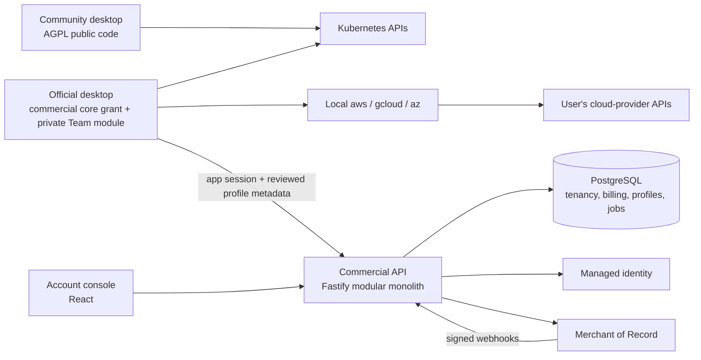

# Kubepit Open Core + Commercial Cloud: Product and Architecture Decision Record

**Date:** 2026-09-29\
**Status:** Proposed implementation baseline; planning only. No license, application code, account, payment product, repository visibility or production infrastructure has been changed.\
**Owner:** Product founder. Implementation may be delegated using the [program handoff](../plans/2026-09-29-commercial-program.md).\
**Scope:** Paid team profiles and cloud-provider import, their cloud control plane, and the boundary with the free open-source desktop.

## 1. Executive decision

Build a small commercial control plane and two premium desktop features around the existing independent, local-first product:

- Publish `kubepit` as a genuinely open-source **AGPL-3.0-only Community** application, conditional on the first-party ownership audit. Offer a separately documented **commercial alternative license for controlled core code** so the official combined application may include proprietary modules. Keep Community functional without an account, a license server, or access to private dependencies. New reusable edition contracts may use MIT under an explicit per-package license boundary.
- Add a separate **private** `kubepit-commercial` repository. It owns billing, organization/team management, cloud profile synchronization, and the proprietary desktop implementations of team profiles and AWS/GCP/Azure discovery/import.
- Use **Node.js 24 LTS, TypeScript, Fastify 5, PostgreSQL 17, Drizzle and `pg`** for a modular monolith. Serve a small React account console and API behind one origin. Use PostgreSQL for durable jobs and an outbox; no Redis, Kubernetes deployment, service mesh, event bus or separate billing microservice is needed for launch.
- Use managed browser identity through an adapter, initially WorkOS AuthKit. Kubepit's database owns organizations, permissions and seats. No home-grown password database and no dependency on the identity vendor's enterprise SSO product for ordinary accounts.
- Use the founder's preferred **Paddle as Merchant of Record**, conditional on seller onboarding and a written quote/approval for the $3 product. Keep a narrow billing adapter so an eligible merchant can use Stripe if necessary. Implement one production provider initially, not two.
- Sell **Kubepit Team** at **USD 3 per purchased seat per month** or **USD 30 per purchased seat per year**. Annual means one $30 charge per seat for twelve months, equivalent to $2.50/month; the discount versus twelve monthly payments is 16.67%.
- The cloud never needs Kubernetes credentials or cloud-provider credentials. Provider CLIs execute locally. Team publishing uploads only a user-reviewed, allowlisted profile payload, which still contains potentially sensitive operational metadata.

The founder clarified that no remote publication or MIT distribution has occurred and a history reset is intended before first publication. Treat this as the planning baseline, subject to an ownership/provenance check; this task does not reset history. Paddle is the stated preference. The AGPL/commercial model is a proposed legal/product decision, not an already enacted license. Seller jurisdiction remains unspecified. Unresolved decisions are launch gates, not reasons to stop designing provider-independent components.

## 2. Document map and authority

| Document                                                                             | Owns                                                                                                           |
| ------------------------------------------------------------------------------------ | -------------------------------------------------------------------------------------------------------------- |
| This strategy                                                                        | Product packaging, priority, assumptions, business boundaries, trust promises                                  |
| [Commercial cloud design](2026-09-29-commercial-cloud-design.md)                     | Database, tenancy, identity, API, subscriptions, seats, signed entitlements, cloud operations                  |
| [Commercial desktop design](2026-09-29-commercial-desktop-design.md)                 | Public extension host, private desktop composition, provider import, team-profile behavior and local lifecycle |
| [Licensing and repository policy](2026-09-29-commercial-licensing-and-repository.md) | Licensing alternatives, limitations, code ownership, public/private release boundaries                         |
| [Program handoff](../plans/2026-09-29-commercial-program.md)                         | Implementation order, checkpoints, assignment boundaries and release gates                                     |
| [Cloud implementation plan](../plans/2026-09-29-commercial-cloud.md)                 | Cloud tasks, files, contracts, test cases and acceptance                                                       |
| [Desktop implementation plan](../plans/2026-09-29-commercial-desktop.md)             | Desktop/public-host/provider/team tasks and acceptance                                                         |

The two 2026-09-28 team/cloud plans remain useful historical implementation references. Their placement of all code in the public core and their file-only team-sharing architecture are superseded by this program. Do not execute them unchanged. Existing product source is the reference for implemented behavior; planning documents must not be mistaken for shipped features.

When details conflict, product packaging here takes precedence, the cloud spec owns wire and billing semantics, and the desktop spec owns in-process host interfaces. Resolve a conflict in documentation and contract fixtures before coding both sides independently. Any changes to prices, time limits or entitlement identifiers update the shared commercial policy manifest and both test suites.

## 3. Observed repository baseline

The repository intended for public release includes a Rust core, a Tauri shell and React frontend. Cargo's workspace license and the root `LICENSE` currently say MIT, but the founder states the code has not yet been shared or published. `pnpm-workspace.yaml` currently includes only `apps/*`. The frontend starts directly from `apps/desktop/src/main.tsx`; the shell's `run()` generates its own Tauri context and registers a single core command handler.

There is substantial uncommitted work, especially around the AI assistant. An implementation agent must inspect and preserve it; this planning task does not commit, relocate or reset it. Use a reviewed base SHA for the commercial composition spike, not an accidental dirty snapshot.

The present public product already includes manual kubeconfig import/export, cluster operations, Helm, GitOps, logs/debug, metrics, recommendations, security, AI and custom actions. This program does **not** retroactively move those implementations behind a subscription.

## 4. Edition and feature matrix

| Capability                                                                | Community / free             | Team subscription                 | Notes                                                                                |
| ------------------------------------------------------------------------- | ---------------------------- | --------------------------------- | ------------------------------------------------------------------------------------ |
| Existing public features and unlimited manually configured clusters       | Yes                          | Yes                               | No account required for free functionality                                           |
| Manual kubeconfig file/paste/discovery/import/export                      | Yes                          | Yes                               | No lock on accessing a cluster imported previously                                   |
| Existing local custom actions, bookmarks and saved views                  | Yes                          | Yes                               | No retroactive paywall                                                               |
| kind/k3d/minikube local lifecycle                                         | Planned free feature         | Same free feature                 | Proposed packaging decision; may ship after paid MVP                                 |
| AWS EKS / GCP GKE / Azure AKS account discovery and managed import        | No built-in provider wizard  | Yes, `cloud_import`               | Users may always use provider CLIs and import kubeconfig manually                    |
| Re-import/refresh credentials through paid provider wizard                | No                           | Yes                               | Existing core kubeconfig repair remains free                                         |
| Organizations, invitations, membership and billing console                | Account management access    | Account management access         | Login alone does not grant premium features; billing-only users need no feature seat |
| Shared team profiles: publish/import/subscribe/cloud sync                 | No built-in team feature     | Yes, `team_profiles`              | Private implementation; portable schema and export format may be public              |
| Team profile exports and cached data recovery after cancellation          | Explicit recovery path       | Yes                               | Do not ransom customer data                                                          |
| Shared executable custom actions                                          | Local actions only           | User-reviewed shared definitions  | Every changed executable definition requires local trust approval                    |
| Enterprise SSO/SCIM, compliance attestations, on-prem license server, SLA | Not promised                 | Not included in $3 launch package | Future separately scoped product; do not advertise prematurely                       |
| AI provider usage                                                         | Existing BYOK/local behavior | Same                              | The $3 fee does not purchase model tokens or cloud compute for workloads             |

Market this as **Community + Team**. “Enterprise” is a future tier only if its operational and contractual obligations are actually delivered. At this price, the initial paid value is time saved in team onboarding, consistent configuration and provider discovery.

## 5. Licensing: the constraint must stay visible

“Open source, but users cannot fork or reuse it” is not a coherent promise. Genuine open-source licenses grant redistribution and derivative-work rights, including commercial uses. A competitor restriction can be designed in a source-available license, but that product must not be advertised as open source. See the [Open Source Definition](https://opensource.org/osd).

Given the unpublished status and desired commercial protection, recommend **AGPL-3.0-only + commercial alternative licensing** for first-party core, and proprietary licensing for new paid modules/cloud code. AGPL is reciprocal: covered source obligations apply to distribution and, under its network clause, qualifying modified software used interactively over a network. It still allows lawful forks, commercial use and competitors. It does not force every program merely used with Kubepit to become open source. Obtain legal review for the actual distribution and linking boundary.

The official combined binary must use a valid commercial grant for the controlled core; merely putting an AGPL core and proprietary linked plugin in separate folders does not solve their licensing obligations. Audit dependencies and copied code; third-party AGPL/GPL contributions cannot be commercially relicensed without the necessary permission. Require an appropriately reviewed contributor agreement with alternate-licensing rights before accepting outside contributions into dual-licensed core; DCO alone does not provide those rights.

Since no outside MIT distribution is reported, old recipient rights are not assumed to exist. If any earlier copies were shared, their actual grants must be honored. A history reset changes git ancestry, not copyright ownership, attribution obligations or existing recipient rights. This program contains policy requirements for legal review, not a self-authored replacement license ready to publish. No LICENSE, manifest license declaration or git history is changed during planning. See the separate licensing decision record for the source-available alternative if an actual competitor-use restriction is non-negotiable.

## 6. Accounts, organizations, teams and seats

- **User:** A global human identity. A user can belong to several organizations. Email is contact/identity evidence; it is not a tenant key and a matching email domain does not automatically grant membership.
- **Organization:** The billing and data-isolation boundary. One organization has one subscription, one interval/currency, purchased seat capacity and its own audit trail. A sole purchaser may create a one-person organization; no forced minimum seat count in the proposed price model.
- **Team:** A group inside one organization. Team membership scopes profiles, not billing. A user in several teams of the same organization consumes one assigned seat. The same user in two paying organizations consumes a seat in each organization when assigned in both.
- **Roles:** Owner, admin, member and billing administrator have separate permissions. A billing-only administrator can manage invoices/subscription without a feature seat and cannot read team profile data merely because they can pay. An owner/admin also needs a feature seat to use premium desktop features.
- **Seat:** Purchased capacity and active assignment are different quantities. Sending an invitation reserves capacity transactionally; accepting converts the reservation into an assignment, without a second charge. Expired/revoked invitations release reservations. Removing someone frees assignment capacity, not an automatic prorated refund or subscription reduction.
- **Last owner:** Ownership cannot be accidentally orphaned. Transfer requires an existing verified member's acceptance; deletion requires reauthentication and an explicit organization-deletion flow.

Do not implement seat eligibility as an email suffix, a client-side Boolean or a JSON property trusted from a checkout redirect. The database and reconciled billing state are authoritative. Display purchased, assigned, reserved and available seats separately.

Example: an organization buys five seats; three members are assigned and one invitation is reserved. Availability is one. Adding the same person to a second team changes neither price nor capacity. Removing one assigned member raises availability to two; the next invoice remains five seats until an authorized billing change.

## 7. Architecture and data movement

There is no control-plane-to-cluster arrow. Kubepit Cloud does not run discovery against customer accounts, proxy Kubernetes commands, store kubeconfigs or hold AWS access keys. The local desktop is responsible for provider CLI execution and cluster credentials.

Profiles can include cluster display names, tags, environments, server matching metadata, saved views, bookmarks, selected monitoring configuration, selected rules and reviewed action definitions. Even without credentials, internal endpoints, names and labels can be sensitive. Publishing requires a preview and explicit selection; joining an organization does not silently upload all local clusters.

“Credentials are not intentionally included” is a testable allowlist guarantee for structured fields. “No secret can ever appear in arbitrary notes or scripts” is not a truthful guarantee. The design excludes high-risk free text by default, scans included content, presents the exact upload payload, and never automatically publishes local history, logs, terminal output or model context. Cloud support staff access is restricted, logged and not described as end-to-end encrypted in v1.

## 8. Why this backend

| Option                                      | Fit                                                                                                           | Decision                                                                                 |
| ------------------------------------------- | ------------------------------------------------------------------------------------------------------------- | ---------------------------------------------------------------------------------------- |
| Node.js + TypeScript + Fastify + PostgreSQL | Reuses TS knowledge; straightforward JSON contracts; relational transactions suit tenant membership and seats | Recommended                                                                              |
| ASP.NET Core + PostgreSQL                   | Technically equally viable; good if the maintaining team prefers C#                                           | No product benefit currently justifies a third main language                             |
| Firebase Authentication + Firestore         | Managed operations; a different transactional/document model and permission system                            | Not selected for the relational billing/membership workload                              |
| Firebase SQL Connect / PostgreSQL           | PostgreSQL is supported, with generated GraphQL APIs and managed integration                                  | Viable alternative; custom billing, entitlements and job handling still need server code |
| Supabase PostgreSQL/Auth                    | Reasonable managed alternative                                                                                | Optional future substitution; never expose service-role credentials to desktop           |

These are workload-specific choices, not claims that other stacks are incapable. Node 24 is an active LTS line at planning time. Fastify 5 lists Node 24 compatibility. Firebase's PostgreSQL offering is documented as SQL Connect; avoid outdated claims that Firebase only supports NoSQL. Sources are linked below; choose supported patch releases and lock dependencies at implementation time.

Managed PostgreSQL plus one container service is the initial production footprint. A local development stack may use Docker Compose with an isolated database and fake identity/billing providers. Hosting provider and region are selected after the founder's company/data-residency decision; avoid a “free tier” assumption for backups, availability or long-term production capacity.

## 9. Offline and cancellation promises

The proposed premium entitlement is signed, bound to a user, organization, application audience and installation/session identity. A fresh lease lasts at most 24 hours. An offline grace period ends at the earliest of last authoritative validation + 7 days and the known paid-through boundary. Signing algorithm, claims, verification and rotation belong to the cloud contract; no custom cryptography.

This grace period is a deliberate business trade-off. A removed employee who stays offline may retain previously cached premium access until that deadline. A disconnected device cannot receive instant revocation, and downloaded data cannot be remotely made unread. State these limits to organization administrators. Received revocation or an authoritative membership/seat denial invalidates the local lease immediately; network timeouts do not masquerade as authorization denials.

On expiration, payment suspension, logout or service outage:

| Surface                                                                       | Behavior                                                                                 |
| ----------------------------------------------------------------------------- | ---------------------------------------------------------------------------------------- |
| Existing clusters, terminals, Helm, YAML, AI BYOK and other free capabilities | Continue working                                                                         |
| Imported managed kubeconfigs                                                  | Remain local and usable through core; no delete/credential revocation                    |
| New premium provider discovery/import                                         | Available only with valid current or grace entitlement                                   |
| Premium wizard already executing                                              | Finish or cancel safely under operation rules; never leave half-written registry entries |
| Cloud team read/write/sync                                                    | Requires live authorization on every request; cached lease does not bypass server policy |
| Previously downloaded team data                                               | Frozen with status/provenance; approved recovery/export/detach available                 |
| Shared executable actions                                                     | No new silent trust; revocation and detach follow explicit local conversion rules        |
| Existing local read-only restrictions                                         | Never automatically weakened by expired subscription or profile removal                  |
| Billing/data-recovery console                                                 | Remains accessible to authorized account holders without an active feature seat          |

Do not promise unbreakable DRM. A user who controls their computer can patch client logic. Cloud tenant authorization protects cloud data; private distribution and license terms protect premium implementation. Hardware fingerprinting, invasive monitoring and periodic process killing are outside the design.

## 10. Billing economics and price presentation

Prices are USD base subscription amounts. Checkout shows the final recurring total, quantity, interval, applicable tax and effective date before consent. Local tax treatment, inclusive/exclusive tax presentation and cancellation rights depend on the merchant/customer jurisdiction and provider contract. Merchant of Record handling of transaction taxes does not eliminate the founder's own accounting, payout or income/corporate-tax responsibilities.

Paddle publishes a standard 5% + $0.50 transaction rate and asks sellers of products under $10 to contact it for custom pricing. Therefore the following table is an **illustrative sensitivity model**, not an approved $3 checkout quote. It excludes tax, FX, refunds, chargebacks, payout costs, infrastructure and support.

| Organization purchase             | Gross charge | Illustrative fee | Amount after fee |
| --------------------------------- | -----------: | ---------------: | ---------------: |
| 1 monthly seat                    |        $3.00 |            $0.65 |            $2.35 |
| 5 monthly seats, one transaction  |       $15.00 |            $1.25 |           $13.75 |
| 20 monthly seats, one transaction |       $60.00 |            $3.50 |           $56.50 |
| 1 annual seat                     |       $30.00 |            $2.00 |  $28.00 per year |
| 5 annual seats, one transaction   |      $150.00 |            $8.00 | $142.00 per year |

The one-seat monthly scenario leaves $28.20 after twelve illustrative fees, nearly the same as $28.00 from one annual payment. This is not true for every organization size or negotiated fee. Bill the organization once per period, not each member separately. Do not invent a minimum seat purchase or change the promised $3 price just to hide a payment-provider limitation; obtain an approved quote or choose an eligible alternative.

At 100 seats, gross normalized recurring revenue is $300/month on monthly subscriptions or $250/month if every seat is annual. At 1,000 seats it is $3,000 or $2,500 respectively. Annual cash received is not the same as monthly recognized revenue or immediately available profit.

Use an initial **planning envelope** of $25–75/month for API/database/backups/email/monitoring before founder time, not a provider price claim. Confirm actual quotes and include managed-auth costs, backups and bandwidth. For illustration, $50/month infrastructure divided by $2.35 net per single-seat monthly transaction needs 22 seats before support, tax and refunds. Avoid presenting this as full business break-even.

No automatic free trial is included in the baseline; the Community edition is the permanent evaluation path. A sandbox demo can demonstrate paid behavior using fixtures. A later time-limited trial needs explicit abuse, entitlement and conversion semantics before being added.

## 11. Privacy, portability and trust contract

1. Community works offline and without a cloud login. Its build and tests do not need private package registries.
2. Cloud opt-in and profile publishing are separate actions. Sign-in does not mean consent to upload infrastructure metadata.
3. Provider credentials, kubeconfigs, cluster data, logs and terminal streams stay on the user's machine unless the user independently uses another existing feature with its own explicit data flow.
4. Publicly document which fields can synchronize and which subprocesses provider discovery starts.
5. Allow organization data export; export permission follows role/scope, not mere billing access. No cross-organization download through “all my data.”
6. Never delete local cluster credentials or local user work as a billing enforcement mechanism.
7. Organization deletion has an explicit export window, provider subscription cancellation, tenant-scoped purge and documented backup aging. Statutory billing retention is separated from operational profile data.
8. No claim that a desktop team preference is Kubernetes authorization. Kubernetes RBAC remains the security boundary; a user can use a different client or the free core.
9. Logs/audits record operational facts, not webhook secrets, profile bodies, executable scripts, kubeconfigs, authentication tokens or payment-card data.
10. Use a clear EULA/Terms, privacy notice, data-processing terms where needed, subprocessor list and OSS notices. Obtain legal review before sales, not a generic checkbox claiming compliance.

## 12. Release scope, non-goals and sequencing

**Foundation:** Licensing/ownership decision, private repository creation, build composition spike, edition compatibility contract, tenant-isolated database, identity, billing sandbox and signed entitlement round trip.

**Paid MVP A:** One-person and multi-seat organization checkout, invitations, member/seat administration, EKS discovery/import, explicit profile publish/subscribe with revisions and local credential mapping. All inactive/expired/free paths must pass before charging.

**Paid MVP B:** GKE and AKS parity, team-scoped profile access, shared views/bookmarks/rules and locally trusted custom actions, billing lifecycle hardening and organization export/deletion. Do not advertise all three providers while only EKS is implemented.

**Companion community feature:** kind/k3d/minikube management. Shared local process infrastructure can land earlier; UI breadth need not block commercial foundations.

**General availability:** All advertised capabilities complete; Windows/macOS/Linux validation, source/license boundary audit, signed distribution/update channels, payment-provider approval, restore drill, cancellation/refund exercise, documented support and privacy processes.

Excluded initially: remote cluster execution, hosted cloud credentials, Kubernetes provisioning in AWS/GCP/Azure, central log/metric ingestion, cross-device terminal sharing, realtime collaborative YAML editing, arbitrary plugin marketplace, SAML/SCIM, self-hosted enterprise backend, usage-based cloud metering and multi-region active-active infrastructure.

## 13. Decision register

| ID  | Decision                                 | Baseline / unresolved item                                                                                     | Consequence                                                                               |
| --- | ---------------------------------------- | -------------------------------------------------------------------------------------------------------------- | ----------------------------------------------------------------------------------------- |
| D01 | Initial license before first publication | Recommended: AGPL-3.0-only core + alternate commercial grant; private paid parts; permissive edition contracts | Ownership/CLA/legal gate; no promise of fork prohibition; no license edit during planning |
| D02 | Merchant entity                          | Country/company status pending                                                                                 | Production payment-provider onboarding and jurisdictional documents wait                  |
| D03 | Payment provider                         | Paddle is founder's preference; eligibility and $3 quote remain conditional                                    | Build fake provider and adapter first; no live charges during implementation              |
| D04 | Free local cluster lifecycle             | Recommended free; no existing feature removed                                                                  | Keep provider cloud wizard private, local tools public                                    |
| D05 | Pricing                                  | $3 monthly / $30 yearly per org seat, USD, one-seat minimum                                                    | Annual plan is $30 charged yearly, never mislabeled $30/month                             |
| D06 | Trial                                    | No automatic paid trial in initial release                                                                     | Demo fixtures and permanent free edition cover evaluation                                 |
| D07 | Team scope and seat counting             | Teams inside org; one seat per assigned user/org                                                               | No team-based double billing                                                              |
| D08 | Offline tolerance                        | 24h fresh, total 7d max, capped at paid-through                                                                | Administrators must understand revocation delay                                           |
| D09 | Data region                              | One region selected before production                                                                          | No unsupported data-residency promise                                                     |
| D10 | Managed identity                         | WorkOS behind adapter, commercial/availability check before launch                                             | Own stable user IDs, exportable external identity mapping                                 |
| D11 | Initial service objectives               | Proposed targets, not contractual SLA                                                                          | Measure before publishing uptime promises                                                 |
| D12 | Profile content                          | Allowlisted metadata, explicit preview; scripts opt-in and trust-gated                                         | No misleading “we cannot see any sensitive data” claim                                    |

Reasonable implementation work proceeds against these baselines. Decisions that affect legal publication, provider enrollment or live billing must be resolved before those specific actions. The implementing agent must not silently create a legal entity, subscribe to a paid service, move repository visibility, publish proprietary source or replace the existing license.

## 14. Program-level acceptance

- Clean public checkout builds/tests offline from Kubepit Cloud with public dependencies only; free app does not call identity/billing endpoints.
- Clean private checkout at a pinned public SHA builds the combined edition without copying proprietary code into the public git history.
- Every controlled-core component in the proprietary build has an auditable alternative commercial grant; third-party licenses/notices remain intact. Public AGPL releases provide corresponding-source compliance. The initial publication commit preserves required attribution even if earlier development history is reset in a separately authorized task.
- One shared definition drives the two price amounts, feature IDs and entitlement bounds; provider sandbox prices are verified against it.
- A user in org A cannot obtain org B's profiles, invoices, invitations, audit events or entitlement by changing identifiers.
- Concurrent invitation acceptance/seat purchase/removal cannot oversubscribe capacity or double-charge a seat operation.
- Duplicate, delayed and out-of-order webhooks converge to the provider's authoritative state without granting unpaid service from a redirect.
- Known revocation applies immediately online; outage/offline behavior is bounded and never harms free cluster access.
- Tampered/missing/expired entitlement, changed OS time and rotated signing keys produce defined safe outcomes.
- A cloud API outage does not hang application startup, block free UI rendering or break existing connections.
- Team updates cannot execute commands, start cloud login or acquire local credentials without explicit local action.
- Provider fixtures prove no writes to `~/.kube/config` and no test reads of actual cloud credentials.
- EN/TR copy, RunHQ visual tokens and demo-mode behavior cover every new user-facing state.
- Export, cancellation, payment recovery, owner transfer and organization deletion are exercised in sandbox before general availability.
- Database backup recovery is actually demonstrated, and signed community/commercial update feeds are independent.

## 15. Sources checked on 2026-09-29

These sources support technology/legal/payment constraints; the proposed product decisions are ours.

- [OSI Open Source Definition](https://opensource.org/osd): redistribution and derivative-work rights.
- [Node.js release schedule](https://github.com/nodejs/Release): Node 24 LTS lifecycle.
- [Fastify LTS policy](https://fastify.dev/docs/latest/Reference/LTS/): supported Node majors; pin supported versions in implementation.
- [PostgreSQL 17 row security](https://www.postgresql.org/docs/17/ddl-rowsecurity.html): owners and BYPASSRLS caveats motivate distinct application roles and FORCE RLS.
- [Firebase SQL Connect](https://firebase.google.com/docs/sql-connect): PostgreSQL/GraphQL managed alternative.
- [WorkOS AuthKit OAuth applications](https://workos.com/docs/authkit/connect/oauth): public-client PKCE support. Our desktop session bridge is specified separately, not an embedded secret.
- [Paddle pricing explanation](https://www.paddle.com/paddle-101): standard transaction rate and under-$10 custom-pricing caveat.
- [Paddle seller country restrictions](https://www.paddle.com/help/start/intro-to-paddle/which-countries-are-supported-by-paddle): supplier eligibility differs from buyer coverage and requires onboarding.
- [Stripe global availability](https://stripe.com/global): merchant availability must be checked for the actual company; do not infer it from the founder's timezone.

External policies and rates can change. Recheck the launch gates when selecting real accounts and signing contracts. The present planning task has not contacted a cluster, read customer credentials, created a paid account, deployed a backend or processed a payment.
